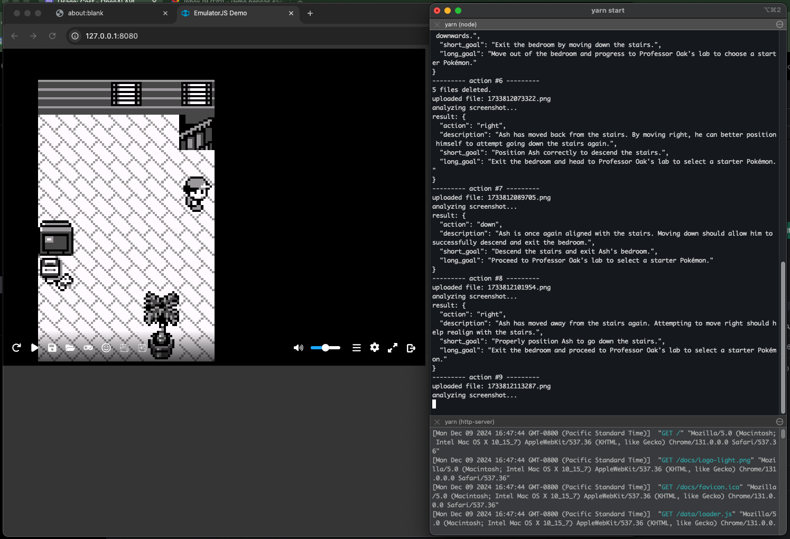

# pokemon-ai



An experiment with AI vision analysis capabilities. An AI model receives screenshots from Pokemon Red running in a GameBoy emulator, analyzes the game state, and decides what button to press next. The game loop is fully automated — Puppeteer captures screenshots, sends them to the AI, and executes the chosen action as a keyboard event. The AI plays the game on its own.

Supports multiple AI providers (Google Gemini, Anthropic Claude, OpenAI) via a plugin architecture — switch between them by changing a single config value.

## how it works

### game loop

Each cycle the app:
1. Pauses the emulator and captures a screenshot
2. Sends the screenshot to the AI provider
3. The AI responds with a JSON object describing what it sees and what action to take
4. The app resumes the emulator and executes the action as a keyboard press
5. Repeats for `MAX_CYCLES` (default 100)

### response format

The AI is constrained to respond with exactly this JSON structure:

```json
{
  "description":  "what the AI sees on screen",
  "ascii_grid":   "a 10x9 ASCII translation of the game tiles",
  "what_changed": "what changed since the last screenshot",
  "short_goal":   "the AI's immediate objective",
  "long_goal":    "the AI's broader objective",
  "action":       "one of: a, b, up, down, left, right, start"
}
```

The `short_goal` and `long_goal` fields are an experiment in "explicit awareness" — by forcing the model to articulate its goals each turn, it creates a form of reinforcement that helps it stay on task over time.

### provider architecture

```
pkmn/
├── index.js                 (game loop — provider-agnostic)
├── providers/
│   ├── base.js              (shared interface + goal seeding)
│   ├── gemini.js            (Google Gemini API)
│   ├── anthropic.js         (Anthropic Messages API)
│   └── openai.js            (OpenAI Chat Completions API)
├── prompts/
│   └── v6.txt               (system prompt)
└── local/
    ├── secrets.js           (provider config + API key)
    ├── rom.gb               (game ROM)
    ├── rom.state            (emulator save state, auto-managed)
    └── goals.txt            (last session's goals, auto-managed)
```

All providers extend a base class and implement the same interface: `init()` and `analyzeScreenshot(filePath)`. The main game loop doesn't know or care which provider is active. Each provider maintains a rolling conversation history (trimmed at 20 exchanges) so the AI has context from previous turns.

### session persistence

The app automatically saves and restores progress between runs:

- **Save state** — At the end of each run, the emulator state is saved to `local/rom.state`. On the next run, it's automatically loaded so the game continues from where it left off.
- **Goals** — The AI's last goals and description are saved to `local/goals.txt`. On startup, these are seeded into the conversation history so the AI knows where it left off. The seed is placed in conversation history (not the system prompt) so it naturally gets trimmed as the session progresses.

### system prompt

The system prompt (`prompts/v6.txt`) instructs the AI to play the opening sequence of Pokemon Red. It includes:
- The constrained JSON response format
- Valid actions and what each button does
- Game state recognition rules (text boxes, menus, overworld)
- An ASCII grid dictionary for translating screenshots into structured tile maps
- Stuck detection and recovery strategies

See the `prompts/` directory for the evolution of prompts across versions.

## how to run locally

Clone this repo onto your machine, then...

### 1. prepare local data

Create a directory named `local` inside the `pkmn/` folder (i.e. `pkmn/local/`). This directory is in `.gitignore` to avoid committing secrets or ROM files you may not have the right to distribute.

Add the following files to `pkmn/local/`:

- **`rom.gb`** — a legally obtained Pokemon Red ROM file.
- **`rom.state`** _(optional)_ — a save-state file if you want to skip ahead in the game. If present, it is loaded automatically on startup.
- **`secrets.js`** — your provider config. Pick **one** of the three providers below and fill in your keys:

**Google Gemini** *(recommended — top-ranked vision model):*
1. Go to [Google AI Studio](https://aistudio.google.com/apikey) and create an API key
2. Configure `secrets.js`:

```js
module.exports = {
  PROVIDER: "gemini",
  apiKey: "YOUR_GOOGLE_AI_KEY",
  model: "gemini-3-pro-preview", // optional, this is the default
}
```

**Anthropic (Claude):**
1. Go to the [Anthropic Console](https://console.anthropic.com/) and create an API key
2. Configure `secrets.js`:

```js
module.exports = {
  PROVIDER: "anthropic",
  apiKey: "YOUR_ANTHROPIC_API_KEY",
  model: "claude-sonnet-4-5-20250929", // optional, this is the default
}
```

**OpenAI:**
1. Go to the [OpenAI Platform](https://platform.openai.com/api-keys) and create an API key
2. Configure `secrets.js`:

```js
module.exports = {
  PROVIDER: "openai",
  apiKey: "YOUR_OPENAI_ACCESS_KEY",
  model: "gpt-5.2", // optional, this is the default
}
```

### 2. prepare emulator

Clone the [EmulatorJS](https://github.com/EmulatorJS/EmulatorJS) project into the repo root (as a sibling to `pkmn/`). Install its dependencies:

```
cd EmulatorJS
npm install
cd ..
```

You do NOT need to start the emulator manually — the app handles that automatically.

### 3. run

From the `pkmn/` directory:

```
cd pkmn
npm install
npm start
```

This single command starts the emulator server, launches a browser, uploads the ROM, and begins playing. Everything shuts down cleanly when the app finishes or is interrupted.

## fine-tuning options

1. `jsonl` dataset with base64 encoded screenshots.
2. `jsonl` dataset with ASCII translations of the map: each type of tile has its corresponding label.
3. OpenAI Gym Retro training: https://openai.com/index/gym-retro/
